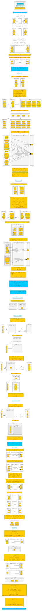
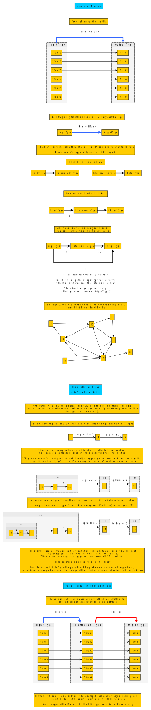

# 组合无处不在

**TL;DR**

观看视频  [The Power of Composition](https://youtu.be/vDe-4o8Uwl8?t=8)

“组合”就意味将一些低级的可重用块集合成更高一级的块。

例如：

- 经典例子：[乐高](https://www.wikiwand.com/en/Lego)

- 家具：使用木头、金属、织物、玻璃和钉子创造桌子、椅子、桌子和柜子等。

但我们要组合那些东西呢？在函数式编程中，我们组成类型（即代数数据类型,`algebraic data types`）和函数。

## 用代数方法组合类型

代数数据类型(ADTs)使用代数来定义给定类型(如 `Set`)可以拥有的值的总数。

这里有两个视频可以观看，下面的表格和图像概括了要点。

- ['Algebraic Data Types' as "Composable Data Types" (29:26)](https://youtu.be/Up7LcbGZFuo?t=1155)

  - 视频 “Power of COmposition” 中解释类似观点。
  - 与 PureScript 的语法不同，但思想是相通的。

- [The Algebra of Algebraic Data Types](https://www.youtube.com/watch?v=YScIPA8RbVE)

  - 注意：视频音质差。
  - 解释了 ADT 背后的 代数定律(algebraic laws)
  - 包括了 `List` 和 `Tree`

| 名称 | 数学操作符 | 逻辑操作符 | PureScript Type | 思想 |
| - | - | - | - | - |
| Product Type | `x * y` | AND | `Tuple` | "One value from type `x` **AND** one value from type `y`" |
| Sum Type | `x + y` | OR | `Either` | "One value from type `x` **OR** one value from type `y`" |
| Exponential Type | `y^x` | ??? | `InputType -> OutputType` | ??? |

## 组合函数

与 type 相似，函数也可以组合，但方式略有不同。

