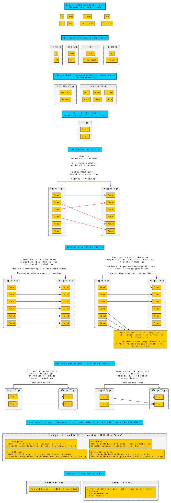

# 纯函数与非纯函数



函数式编程利用函数来创建程序，并注重将纯函数与非纯函数分开。它也是先描述计算后运行，而不是立即执行。

## 概述

### 属性

下表显示了纯函数和非纯函数的比较。

- Sam Halliday - ["Functional Programming for Mortals with Scalaz"](https://leanpub.com/fpmortals) 原创
- 许可：CC BY-SA 4.0

纯函数有 3 个属性，但是第三个属性(标记为 `*`)被扩展来展示其全部权重

|     | 纯函数 | 纯函数例子 | 非纯函数 | 非纯函数例子 |
| --- | ---- | ------------ | ------ | -------------- |
| 给定输入，一定能够获得某些输出？ | Always <br> (全函数) | `n + m` | Sometimes <br> (偏函数) | `4 / 0 == undefined`
| 给定相同输入，一定会得到相同的输出？ | Always <br> (确定性函数) | `1 + 1` always equals `2` | Sometimes <br> (非确定性函数) | `random.nextInt()`
| *与现实世界有交互吗？ | Never |  | Sometimes | `file.getText()` |
| *它是否访问或修改程序状态 | Never | `newList = oldList.removeElemAt(0)`<br>Original list is copied but never modified | Sometimes | `x++`<br>variable `x` is incremented by one.
| *它会抛出异常吗？ | Never | | Sometimes | `function (e) { throw Exception("error") }` |

<hr>

> **Pure Function**
>
> A pure function is a function that depends only on its declared input parameters and its algorithm to produce its output. It does not read any other values from “the outside world” — the world outside of the function’s scope — and it does not modify any values in the outside world.
>
>   - The function always evaluates to the same result value given the same argument value(s). It cannot depend on any hidden state or value, and it cannot depend on any I/O.
>   
>   - Evaluation of the result does not cause any semantically observable side effect or output, such as mutation of mutable objects or output to I/O devices.
>
> source from: https://alvinalexander.com/scala/fp-book/definition-of-pure-function/
>
> **Partial Function**
>
> A partial function is a function that is not defined for all possible arguments of the specified type.
>
> source from: https://wiki.haskell.org/Partial_functions

在很多 OO 语言中，纯代码和非纯代码混杂在一起。如果不检查函数的主体，很难理解函数的作用。在 FP 语言中，纯代码和非纯代码被干净利落地分开，让我们可以不看代码的实现而更容易理解代码的作用。

用 FP 语言编写的程序通常只有一个通过 `main` 函数的入口。`Main` 是一个调用纯代码的非纯函数。

有时，FP 程序员仍然会写出非纯代码，但他们会将非纯代码限制在一个小的局部范围内，以防止其非纯代码泄露。例如，对一个数组的内容进行排序，重用原来的数组，而不是将其内容复制到一个新的数组中。同样，非纯代码也不是被完全扔掉，而是和纯代码明确区分开来，这样人们就能更快、更容易理解代码。

### 图归约

在源代码中，我们可以根据内容出现在 `=` 字符的哪一面来描述函数的各个部分。

- 左侧(LHS)：函数名称和所有参数。
- 右侧(RHS)：功能的主体或执行。

```purescript
|         LHS         |    |     RHS     |
functionName int1 int2   =   int1 + int2
```

在使用纯函数时，可以将 LHS 替换为 RHS，程序的工作原理还是一样的。这个概念被称为引用透明(`referential transparency`)。

```purescript
functionName 4 3
-- replace LHS with RHS
4 + 3
-- reduce into final form
7
-- Calling `function 4 3` could be removed and replaced
-- with `7` and the program would work the same

-- Similarly, the below function (a longer form syntactically) and its arguments
-- could be replaced with `6` and the program would work fine.
(\arg1 arg2 arg3 -> arg1 + arg2 + arg3) 1 2 3
-- replace LHS with RHS
(\     arg2 arg3 ->    1 + arg2 + arg3)   2 3
(\          arg3 ->    1 +    2 + arg3)     3
(\               ->    1 +    2 +    3)
                       1 +    2 +    3
                       1 +    5
                       6
```

虽然上面的例子是非常简单的函数，但想象一下，如果一个人的整个程序是一个表现出这种行为的函数。如果是这样的话，那就很容易理解和推理出这样的程序。

## 执行 VS 描述和解释

```purescript
-- Most OO languages
executeCode :: Int
executeCode = 3

-------------------------------

-- FP languages
-- a type with only one value, Unit
data Unit = Unit

-- Rather than write "Unit", we can now write 'unit' to refer to that value.
unit :: Unit
unit = Unit

-- A function that takes a 'unit' as an input type and returns a 'someValue' type
-- The type of 'someValue' will be defined later.
type ComputationThatReturns someValue = (Unit -> someValue)

describeCode :: ComputationThatReturns Int
describeCode unitValue__neverUsed = 3

interpretDescription :: ComputationThatReturns Int -> Int
interpretDescription compute = compute unit
-- using a graph reduction, this ends up looking like:
--
-- compute unit
-- (\unitValue__neverUsed -> 3) unit
-- (                      -> 3)
--                           3
-- 3
```

简而言之，FP 程序是对要做什么进行"描述"，随后由运行时系统（RTS）"解释"（即执行）。
