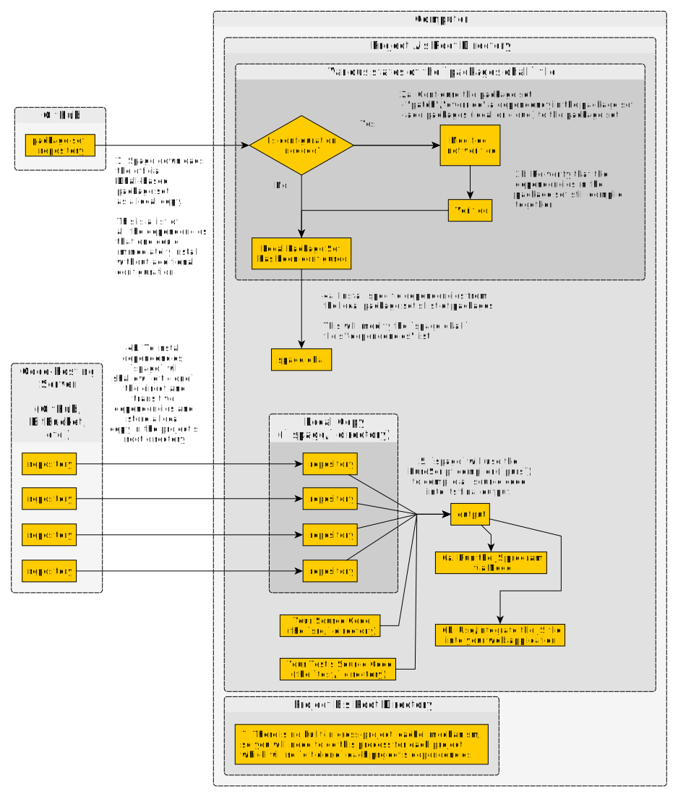

# Spago

## 它是什么

一种使用特定版本的库的方法，这些库是通过 CI 认证没有问题地编译在一起。

## 为什么用它

spago 只允许您使用在特定 PureScript 版本上一起编译的依赖关系。你不需要追踪使用哪个版本的 `DependencyA` 来确保它在你同时使用 `DependencyB` 时能够编译。此外，您也不必验证 `v1.0.0` 版本的 `DependencyA` 是否可以在 `PureScript 0.13.6` 版本而不是 `0.11.7` 版本上运行。

当一个具有突破性变化的新 PureScript 版本发生时，使用 `bower` 是很痛苦的，直到生态系统 "赶上"。由于一个新版本吸引了很多人，他们在使用 `bower` 时对 PureScript 的最初探索可能是可怕的。

`spago` 允许你：

- 用你自己的版本 "打补丁 "一个依赖关系
  - 修正其实施中的一个错误
  - 更新一个库到一个较新的PS版本，如果它还没有被完成
  - 更新一个库的转义依赖关系到一个较新的版本，而不需要提交 PR
- 添加官方软件包集中没有的本地或基于云的依赖关系
  - 一个您经常使用的项目，比如一个自定义的 Prelude 库
  - 一个包含您喜欢的函数/值别名的项目(例如，使用 `<!>` 代替 `<$>` 来表示 `map`)

## 它如何工作

### Spago 计划

在这里，一个包就包括 4 个东西：

- 一个 Git repo
- 某个标签
- 它的一组依赖关系（也是包）
- 一个名称，用来指代上述三者的组合。

因此，一个包是一个唯一命名的 `repo-tag-dependencies` 组合（例如，prelude 可以在 ['v4.1.1' 标签处表示Prelude repo](https://github.com/purescript/purescript-prelude/tree/v4.1.1)）。

一个**包集**由一组包组成。它是一个类似 JSON的文件，将包名映射到对应的 `repo-tag-dependencies` 组合。包集会被**验证**，以确保它的包集能在给定的 PureScript 编译器版本上一起编译。一旦经过验证，它们就被认为是 "不可改变的"。

一个包集包括所有的依赖关系：直接的和它们的转义依赖关系。例如，如果包集包括包 `PackA`，而 `PackA`依赖于包 `PackB`，那么包集必须包括这两个包。

- `PackA`
  - 版本: v1.0.0
  - Repo: `https://exampleRepo.com/PackA.git`
  - 依赖: `["PackB"]` (spago会在包组中查找 "PackB" 来解决它)
- `PackB`
  - 版本: v1.0.0
  - Repo: `https://exampleRepo.com/PackB.git`
  - 依赖: [] (无依赖)

### 它使用的过程

这里有一个全局流程图，说明它做了什么，以及它是如何融入开发者工作流程的。

## 问题要点

- 主要问题
  - 你不能用这个工作流程来开发库，要使用 `pulp` 和 `bower` 来实现。
- 小的问题（有变通方法）
  - 没有内置的 `browserify` 命令（如 `pulp`）。所以，你需要自己执行那个命令。
  - 就像 `bower` 一样，你仍然需要使用 `npm` 来安装任何 `PureScript` 绑定的 `JavaScript` 库。请看 https://github.com/purescript/spago#why-cant-spago-also-install-my-npm-dependencies 查看具体原因。
