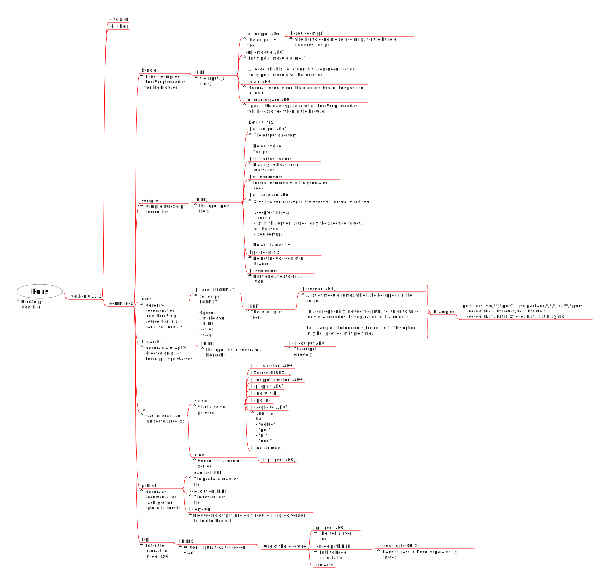
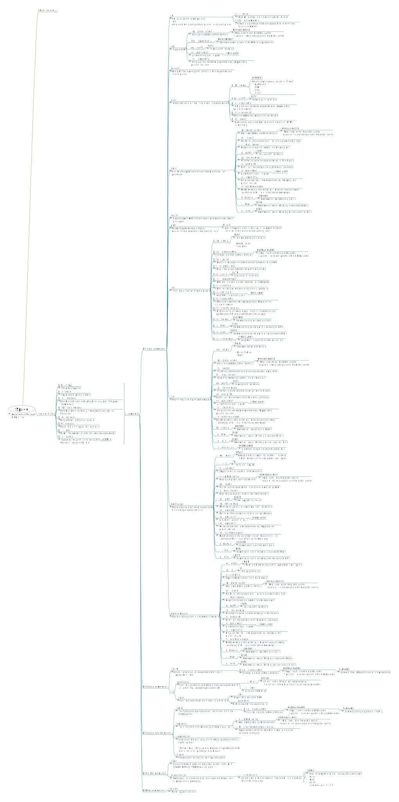
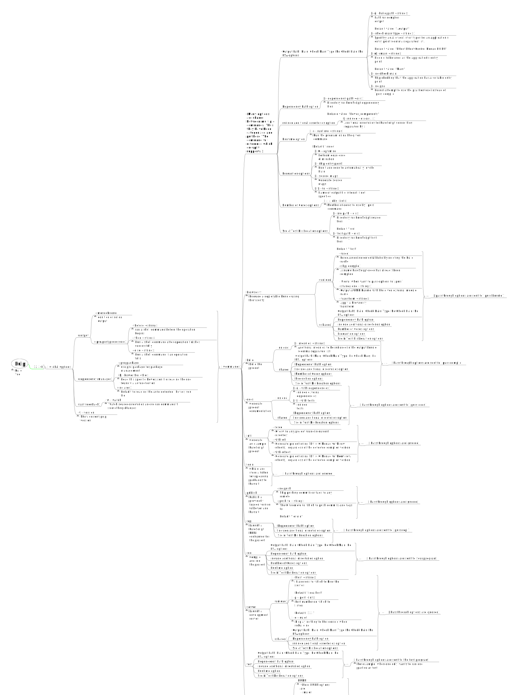

# CLI

通过思维导图的形式来阅读各种程序（如 `purus`、`pulp`、`spago` 等）的文档，而不是类似于 `man-page` 的格式，更容易理解如何使用这些程序。我使用 Freeplane 创建了 `./assets/` 文件夹中的思维导图文件和下面的 SVG 文件。

## Purs (PureScript Compiler)

文档版本 `0.12.3`

## Spago (PureScript 编译工具 & 依赖管理工具)

文档版本 `0.13.0`

CLI 在 `0.12.1` 和 `0.13.0` 之间没有变化。

## Pulp(PureScript 构建工具)

文档版本 `12.3.0`

