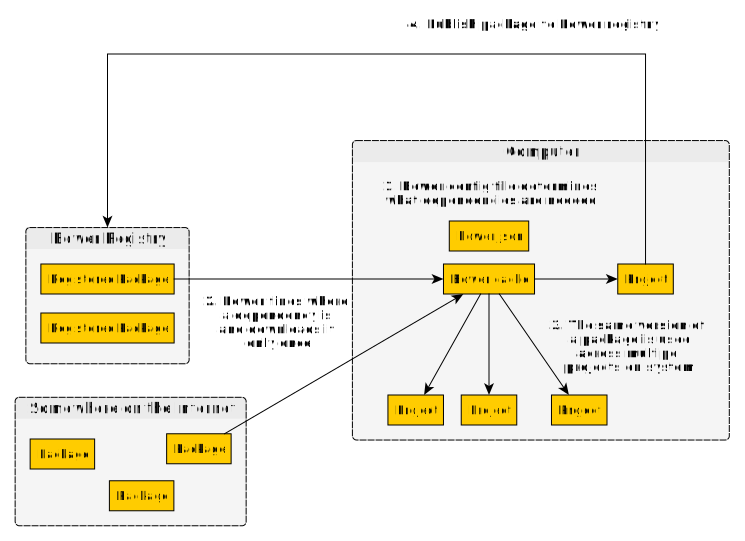

# Bower

## 它是什么

一个典型的依赖管理器，可以从一个集中的资源库中下载依赖关系。



## 为什么用它

在开发一个库的时候，需要引用特定版本的依赖关系，这些依赖关系不会随着时间的推移而改变。

如果使用 spago，他们可以修改依赖的“二进制”而不改变它所引用的版本。对于应用开发者来说，这可能是可取的。但对于库开发者来说就不一样了。

不过，这并不意味着我们不能通过 `bower` 来做类似的事情。摘自 `hdgarrood` 的 FP Slack：

> 在 `bower.json` 中，你可以使用 `"dependencies":{"purescript-some-library":"https://github.com/githubUser/purescript-some-library#my-branch"}` 取代 `"dependencies":{"purescript-some-library":"^0.1.0"}`。你也可以使用 `bower link`，这样做可能更加灵活。

有些人喜欢 `bower` 而不是 `spago`，而另一些人不一样。了解两者并做出你的决定。

## 为什么 PureScript 不使用 `npm`

下面的内容是 [_Why the PureScript Community Uses Bower_](https://harry.garrood.me/blog/purescript-why-bower/) 的简短解释。

简要答案：

- 因为当使用同一个转义依赖的多个版本时，NPM 不会产生错误。

详细答案：

- 当包 `child1` 需要 `parent v1.0.0` 和包 `child2` 需要 `parent v2.0.0` 时会嵌套这两个包，NPM 就会将这两个包编译。
- 如果一个或两个包都导出了暴露 `parent` 的东西，而我们的代码又使用了它，这将产生一个运行时错误，要么是因为某些API不存在（例如，一个版本改变/删除了某些API），要么是因为模式匹配不成功（例如，由于看到 `parent` 中定义了不同的类型，`instanceOf` 检查失败）。
- Bower 使用 "flat "的依赖关系，所以它会通知你存在这样的问题，要求你选择你想使用的库版本来解决这个问题。

## 问题要点

除了下面说的那些，你必须使用 `npm` 来安装绑定的 JavaScript 库。这对 `bower` 和`spago` 都是一样的。

### 最常见的 Bower 问题的解决方案：缓存机制

当有疑问时，运行以下命令，重新安装也许能够解决你的问题。

```bash
# Deletes the 'bower_components' and 'output' directories,
# ensuring that the cache mechanism is not corrupting your build
# and that the next build will be completely fresh.
rm -rf bower_components/ output/
```

### 在一个突破性的变化发布之后发生的可怕用户体验

由于 PureScript 语言趋于稳定，以下问题发生的频率越来越低，但仍需说明。

#### 恼人的定义

如果最近发布了包含中断性更改的编译器版本，生态系统中的库需要一些时间才能与该版本兼容。如果您使用 Bower 作为您的依赖管理器，它可能会尝试安装与新版本不兼容的库，从而产生问题。

#### 基本原则

在这种情况下，请按照以下指南来帮助查找正确的库的版本。

- 进入 Pursuit 查看软件包页面。选择其中一个库的版本，并将该版本的发布日期与编译器发布日期进行比较。那些发生在编译器版本发布之后的，很可能与新版本兼容。
- 由于 `purescript-prelude` 是大多数库的依赖关系，所以要看看库使用的 `purescript-prelude` 是哪个版本。这应该表明它是否与新的编译器版本兼容。
- 如果一切都失败了，请检查库库中最近的几条提交信息，看看是否有更新到新编译器版本的信息。
