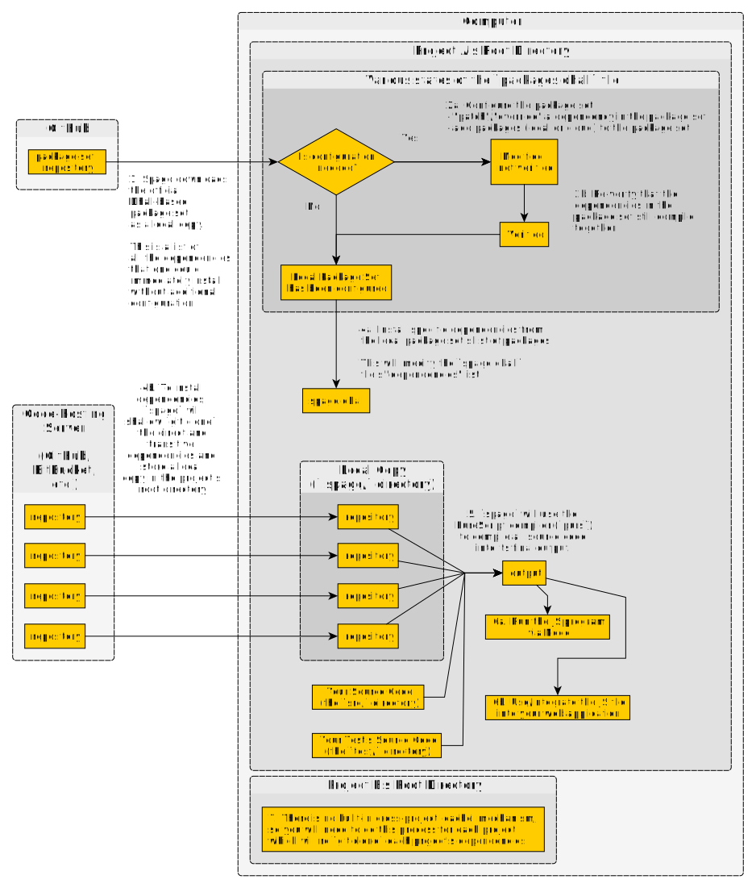

# Spago

## 它是什么

一种使用特定版本的库的方法，这些库是通过 CI 认证没有问题地编译在一起。

## 为什么用它

## 它如何工作

### Spago 计划

在这里，一个包就包括 4 个东西：

- 一个 Git repo
- 某个标签
- 它的一组依赖关系（也是包）
- 一个名称，用来指代上述三者的组合。

### 它使用的过程

这里有一个全局流程图，说明它做了什么，以及它是如何融入开发者工作流程的。

## 问题要点

- 主要问题
  - 你不能用这个工作流程来开发库，要使用 `pulp` 和 `bower` 来实现。
- 小的问题（有变通方法）
  - 没有内置的 `browserify` 命令（如 `pulp`）。所以，你需要自己执行那个命令。
  - 就像 `bower` 一样，你仍然需要使用 `npm` 来安装任何 `PureScript` 绑定的 `JavaScript` 库。请看 https://github.com/purescript/spago#why-cant-spago-also-install-my-npm-dependencies 查看具体原因。
