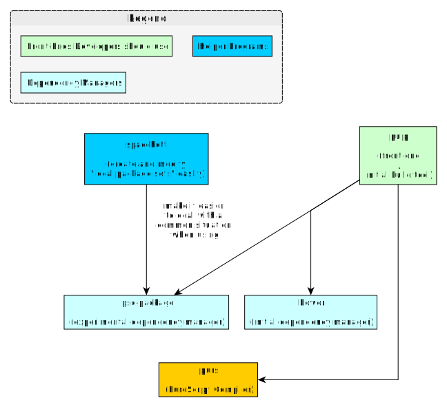

# 编译工具

本文件夹可完成以下任务：

- 解释整个生态系统中使用的各种工具及其用途/区别。
- 记录 Bower 和 Spago 依赖管理器之间的差异。
- 记录 Pulp 和 Spago 构建工具之间的差异。
- 记录最常用工具的 CLI 选项（如 purus、pulp、spago 等）。
- 记录从项目开始到结束的典型工作流程（创建、快速反馈开发、初始发布、更新发布）。

## 历史：我们怎么来的

下面的解释并没有涵盖 PureScript 生态系统中使用的所有工具。不过，它为以后的文件提供了相关信息。

### 阶段1：初始化工具

### 阶段2：`psc-package` 实验

### 阶段3：通过 Spago 改进 psc-package 开发者工作流程

### 阶段4：Spago 成为主流，而 psc-package 则很少使用

### 阶段5：`bower` 不再接受新文件注册

## 工具概览

| 名称 | 类型/用法 | 注释 | URL |
| - | - | - | - |
| purs | PureScript Compiler | Used to be called `psc` | -- |
| psvm-js | PureScript Version Manager | -- | https://github.com/ThomasCrevoisier/psvm-js
| bower | Dependency Manager | -- | https://bower.io/ |
| pulp | Build Tool | Front-end to `purs`. Builds & publishes projects | https://github.com/purescript-contrib/pulp |
| spago | Build Tool | Front-end to `purs` and `psc-package` projects | https://github.com/purescript/spago
| pscid | `pulp --watch build` on steroids | Seems to be a more recent version of `psc-pane` (see below) and uses `psa` | https://github.com/kRITZCREEK/pscid
| psa | Pretty, flexible error/warning frontend for `purs` | -- | https://github.com/natefaubion/purescript-psa

下面的似乎已被弃用或不再使用：

| 名称 | 类型/用法 | 注释 | URL |
| - | - | - | - |
| psc-package | Dependency Manager | -- | https://github.com/purescript/psc-package |
| psc-pane | Simplistic auto-reloading REPL-based IDE | No longer used? Last updated 1 year ago... | https://github.com/anttih/psc-pane
| gulp-purescript | Gulp-based Build Tool | No longer used? Last updated 1 year ago... | https://github.com/purescript-contrib/gulp-purescript |
| Purify | -- | Deprecated in light of psc-package | -- |

对于这个 repo，我们将使用 `spago` 作为构建工具和依赖项管理器。
